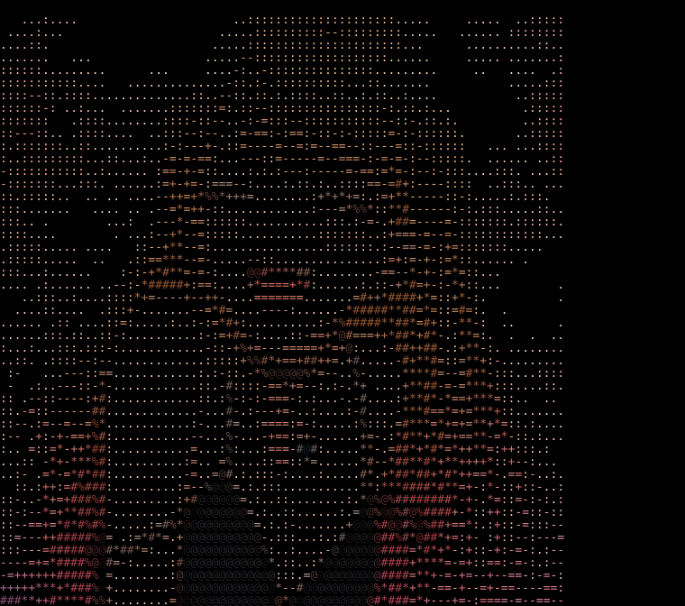

<div align="center">

# `arischatrus`

### `self-taught cybersecurity learner · junior pentester · future red teamer`

*I like understanding how systems work, finding where they break, and learning how to break them — ethically.*

<br>



<br>

[](https://tryhackme.com/p/arischatrus)
[](https://discord.com/users/599289639097860097)
[](mailto:arischatrus@proton.me)

</div>

---

## `whoami`

I'm a self-taught cybersecurity learner currently focused on **offensive security and penetration testing**.

My main interest is understanding how attackers think, how defenses can be bypassed, and how vulnerabilities can be found and exploited **ethically and responsibly**.

I'm currently following the **Junior Penetration Tester** path on TryHackMe and building my foundations toward a long-term goal in **red teaming**.

Outside cybersecurity, I study **Electrical & Electronics Engineering**.

```text
┌─────────────────────────────────────────────────────┐
│                                                     │
│  focus        →  penetration testing                │
│  interests    →  vulnerability research            │
│  direction    →  offensive security                 │
│  long-term    →  red teaming                        │
│                                                     │
└─────────────────────────────────────────────────────┘
```

## `learning`

I'm currently building deeper practical knowledge in:

* Web application penetration testing
* Network penetration testing
* Active Directory
* Vulnerability discovery & exploitation
* Privilege escalation
* Enumeration & reconnaissance
* OSINT
* Security tooling
* Cryptography fundamentals
* Malware analysis fundamentals
* Defensive concepts and SIEM fundamentals

My approach is simple:

> **Understand → Enumerate → Exploit → Learn → Repeat**

---

## `toolkit`

### Systems & Networking

`Linux` · `Windows` · `Networking Fundamentals` · `Active Directory` · `Docker`

### Offensive Security

`Nmap` · `Burp Suite` · `Metasploit` · `Hydra` · `Gobuster` · `ffuf` · `Wireshark`

### Web Security

`HTTP/HTTPS` · `Web Enumeration` · `SQL Fundamentals` · `Burp Suite` · `Directory Discovery`

### Scripting

`Python (basic)` · `Bash (basic)` · `PowerShell (basic)` · `SQL (basic)`

### Other Areas

`OSINT` · `Cryptography Fundamentals` · `Malware Analysis Fundamentals` · `Digital Forensics Concepts` · `SIEM Concepts`

> I'm still learning many of these areas, so this list represents tools and concepts I've worked with rather than claiming professional-level expertise.

---

## `progress.log`

```text
[✓] TryHackMe Pre Security
[✓] TryHackMe Cyber Security 101
[✓] 130+ TryHackMe rooms completed
[→] TryHackMe Junior Penetration Tester
[→] Building practical offensive-security skills
[→] Learning through labs, CTFs and experimentation
[ ] Build meaningful security projects
[ ] Start publishing technical write-ups
[ ] Develop deeper Active Directory skills
[ ] Move toward advanced red-team tradecraft
```

---

## `what's_next`

I'm not trying to collect as many tools or badges as possible.

The goal is to become **really good at understanding systems**.

### Short term

* Finish the Junior Penetration Tester path
* Improve web and network pentesting skills
* Become more comfortable with scripting
* Build my first useful security projects
* Start documenting what I learn

### Long term

```text
Pentesting
    ↓
Advanced Offensive Security
    ↓
Red Teaming
    ↓
Specialization
    ↓
Leadership
```

Eventually, I'd like to become a highly specialized **red teamer** and eventually lead an offensive-security team.

---

## `projects`

Currently building this section from scratch.

I don't want to fill my GitHub with artificial projects just to make the profile look impressive. As I build things that are actually useful, they'll appear here.

```text
~/projects

├── coming-soon/
├── security-labs/
├── writeups/
└── tools/
```

---

## `learning_by_doing`

Most of my cybersecurity learning comes from hands-on environments rather than just reading theory.

```text
TryHackMe
   │
   ├── Pre Security             ✓
   ├── Cyber Security 101      ✓
   ├── Junior Pentester        →
   │
   └── CTFs & practical labs   →
```

I'm especially interested in the point where theory becomes practical:

**enumeration → attack surface → vulnerability → exploitation → privilege escalation → impact**

---

## `contact`

If you'd like to talk about cybersecurity, CTFs, pentesting, Linux, or anything I'm currently learning:

<div align="center">

**TryHackMe** · **Discord** · **Email**

</div>

---

<div align="center">

```text
┌──────────────────────────────────────────────┐
│                                              │
│   "The goal isn't to know every tool.       │
│    It's to understand what the tools reveal."│
│                                              │
└──────────────────────────────────────────────┘
```

### `keep learning. keep breaking. break responsibly.`

</div>
